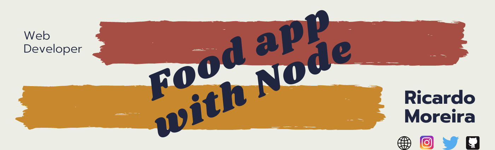
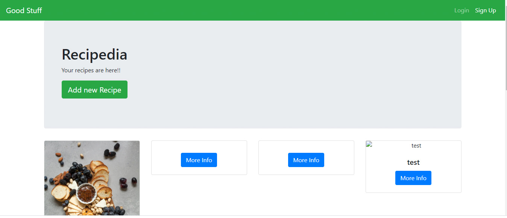

<h1 align="center"> 🔥Food App🔥</h1>

<h2 align="center"> A recipe app made with Node.js and Express</h2>

### Index

* [Name](#Name) 👈
* [Links](#Links) 🔗
* [Description](#Description) 📖
* [Languages and Frameworks](####Languages-and-Frameworks) ⚙️
* [Screenshots](#Screenshots) 📱
* [Instalation](#Instalation) 🧩
* [Support](#Support) 🆘
* [Roadmap](#Roadmap) 🗺️
* [Authors and acknowledgment](####Authors-and-acknowledgment) ✍️
* [Project Status](#Project-Status) 📜

# Name

Ruckwater

# Links

[Website](https://cryptic-oasis-44930.herokuapp.com//)

___

# Description

My first approach to the back end world with this small app made with Node.js and exppress.js. User can add recipes and create an account.

___

# Languages, Frameworks and others

* **Javascript** - Language
* **Node.js** - Backend Language
* **Express.js** - Framework
* **CSS** - Date library

____

# Screenshots

Home Page         |  Blog Page
:-------------------------:|:-------------------------:
  |  

____

# Instalation

___

# Support

Have any question or find something that doesn't look good? Let's talk 😊

[Here](https://github.com/mugas)

[And Here](https://www.ricardomoreira.io/about)

____

# Roadmap

Nothing to add for now

____

# Authors-and-acknowledgment

* [Based on this](https://www.udemy.com/join/login-popup/?next=/course/the-web-developer-bootcamp/)

* Me 😊

____

# Project-Status  

Nothing to add for now

____
